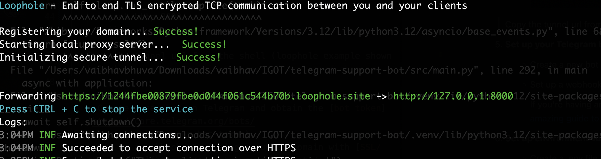

# KB Telegram Support Bot

The Telegram Bot is a Python-based bot that interacts with the KB Agent API Server via Telegram. It allows users to perform various actions and access information from the API Server through the convenience of a Telegram chat interface.

## Prerequisites

- Python 3.12+
- [Redis](https://redis.io/) (for user session)
- Telegram bot and token
   - Create a new bot on Telegram and obtain the [bot token](https://core.telegram.org/bots/tutorial#obtain-your-bot-token)
- Tunnel - Tunneling exposes your local system to the services on the web by tunneling the external calls to your local system. Either of these two popular services can be used:
   - Loophole - Please refer to the [Loophole Quickstart Guide](https://loophole.cloud/download/) for installation.
   - Ngrok - Please refer to the [Ngrok Quickstart Guide](https://ngrok.com/docs#getting-started) for installation.
- Virtual environment (recommended).

## Installation

1. Clone and Change the directory to the project root.

   ```bash
   git clone https://github.com/KB-iGOT/telegram_support_bot.git
   cd telegram_support_bot
   ```

2. Install Dependencies

   ```bash
   pip install uv && uv sync
   ```
3. Active a virtual environment

    ```bashs
    source .venv/bin/activate  # On Linux/macOS
    source .venv\Scripts\activate  # On Windows
    ```
4. Set up environment variables
   - Create a .env file in the project root and add the following variables:
      ```bash
      LOG_LEVEL="INFO" # INFO, DEBUG, ERROR

      TELEGRAM_BASE_URL=https://your-telegram-callback-url.com
      TELEGRAM_BOT_TOKEN=your-telegram-bot-token
      TELEGRAM_BOT_NAME=your-telegram-bot-name
      
      KB_AGENT_BASE_URL=your-agent-service-base-url
      SUPPORTED_LANGUAGES=en,bn,gu,hi,kn,ml,mr,or,pa,ta,te
      
      REDIS_HOST=your-redis-host
      REDIS_PORT=your-redis-port
      REDIS_INDEX=your-redis-index
      ```
      And update the value of above variables in the `.env` file.

      **Note:** This telegram bot only supports the following languages: en, bn, gu, hi, kn, ml, mr, or, pa, ta, te.

      You can find further configuration parameters in `src/core/config.py`.


5. Start a new shell session and start tunnel for port 8000 on your system
   - For Loophole, use the following command:
      ```
      ./loophole http 8000
      ```
   - For ngrok, use the following command:
      ```
      ngrok http 8000
      ```

      Copy the tunnel url from the shell (loophole example shown below) and add it to `TELEGRAM_BASE_URL` in the `.env` file. 
      
      
      For example:
      ```
      TELEGRAM_BASE_URL=https://1244fbe00879fbe0a044f061c544b70b.loophole.site
      ```

6. Set up a webhook URL [Optional]
   - Webhook URL registration with Telegram will happen automatially when this service starts.

   If you want to do mannualy then check the below documents:

   - Set up a webhook URL (using a public domain with [SSL/TLS support](https://core.telegram.org/bots/webhooks#always-ssl-tls))

     If you're having any trouble setting up webhooks, please check out this [amazing guide to webhooks](https://core.telegram.org/bots/webhooks).


## Usage

1. Ensure Redis is running. If not installed, you can download it from [official Redis website](https://redis.io/).

2. Start the Starlette app:
   ```bash
   python3 telegram_webhook.py
   ```

3. Once the Telegram bot is up and running, you can interact with it through your Telegram chat app. Start a chat with the bot and use the available commands and features to perform actions and retrieve information from the API Server.

   - The bot provides the following commands:

      ```bash 
      /start: Start the conversation with the bot
      ```
   - Select preferred language
   - Start querying questions

## Contributing
Contributions are welcome! If you find any issues or have suggestions for improvements, please open an issue or submit a pull request.

## License
This project is licensed under the MIT License.
